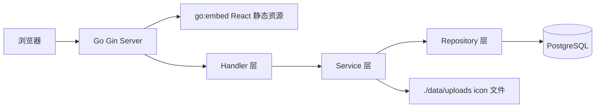
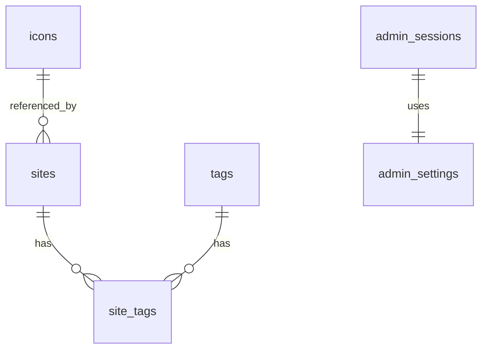

# Navbox 整体架构方案

## 一、项目概述

Navbox 是一个自托管导航站，用于集中管理网站入口。系统提供游客只读访问和 admin 管理访问。游客可以查看、搜索、筛选、打开和复制网站链接；admin 可以管理网站、Tag、图标、排序、常用、默认视图、密码、导入导出等配置。

后端使用 Go 提供 API、Session 鉴权、PostgreSQL 持久化和静态资源服务。前端使用 React/Vite/TypeScript 构建，生产构建产物通过 `go:embed` 嵌入 Go 二进制。部署方式为 Docker / Docker Compose。

## 二、业务需求

### 2.1 MVP 功能

| 模块 | 功能 | 优先级 |
| --- | --- | --- |
| 首页展示 | 展示网站卡片、Tag 列表、默认 Tag 视图 | P0 |
| Tag 筛选 | 多 Tag 同时筛选，规则为同时包含所有选中 Tag | P0 |
| 搜索 | 按标题、描述、URL、Tag 名称搜索 | P0 |
| 游客只读 | 游客只能查看、搜索、筛选、打开、复制链接 | P0 |
| admin 认证 | 初始随机密码、登录、Session、退出、修改密码 | P0 |
| 网站管理 | 新增、编辑、删除、排序、常用、绑定 Tag | P0 |
| Tag 管理 | 新增、编辑、删除、颜色、图标、排序、默认 Tag | P0 |
| 图标管理 | 上传 icon，保存到 `./data/uploads/` | P0 |
| 批量管理 | 批量添加 Tag、移除 Tag、删除网站、调整顺序 | P1 |
| 导入导出 | JSON 导入导出，支持全部、指定网站、指定 Tag，包含 icon | P1 |
| 最近访问 | 浏览器本地存储，不写服务端 | P1 |
| Docker 部署 | Go 服务 + PostgreSQL + uploads 挂载 | P0 |

### 2.2 角色权限

| 能力 | 游客 | admin |
| --- | --- | --- |
| 查看网站 | 支持 | 支持 |
| 搜索网站 | 支持 | 支持 |
| Tag 筛选 | 支持 | 支持 |
| 打开网站 | 支持 | 支持 |
| 复制链接 | 支持 | 支持 |
| 最近访问本地记录 | 支持 | 支持 |
| 登录 admin | 不支持 | 支持 |
| 管理网站 | 不支持 | 支持 |
| 管理 Tag | 不支持 | 支持 |
| 上传 icon | 不支持 | 支持 |
| 批量管理 | 不支持 | 支持 |
| 导入导出 | 不支持 | 支持 |
| 修改密码 | 不支持 | 支持 |

## 三、系统架构

系统采用单体架构，Go 服务同时提供 API 和嵌入式前端静态资源。



请求分层：

```text
HTTP Request
  -> Gin Middleware
  -> Handler
  -> Service
  -> Repository
  -> PostgreSQL / File Storage
```

分层约束：

1. Handler 只负责参数绑定、校验和响应封装。
2. Service 承载业务逻辑、权限语义和事务控制。
3. Repository 只负责数据访问。
4. Model 和 DTO 分离，禁止直接向前端暴露 GORM Model。
5. admin 写接口必须通过 Session Middleware 校验。

## 四、技术栈决策

| 层级 | 技术 | 说明 |
| --- | --- | --- |
| HTTP | Gin | 路由、Middleware、参数绑定 |
| ORM | GORM | PostgreSQL 数据访问 |
| 数据库 | PostgreSQL | Docker 部署可靠，适合持久化导航数据 |
| 日志 | Zerolog | 结构化日志，日志内容使用英文 |
| 配置 | Viper | 支持默认配置、文件、环境变量覆盖 |
| 依赖注入 | Uber Fx | 管理模块依赖和生命周期 |
| 密码存储 | bcrypt | admin 密码加密存储 |
| 前端 | React + Vite + TypeScript | 构建 SPA，生产产物嵌入后端 |
| 图标 | 文件系统 | `./data/uploads/` 存储上传或导入的 icon |
| 部署 | Docker Compose | `navbox` 服务 + `postgres` 服务 |

## 五、模块划分

```text
cmd/navbox/              应用启动入口
config/                  配置文件示例
internal/config/         强类型配置加载
internal/model/          GORM Model
internal/dto/            请求和响应 DTO
internal/repo/           Repository 数据访问
internal/service/        Service 业务逻辑
internal/handler/        Gin Handler
internal/middleware/     Session、Recovery、日志中间件
internal/storage/        icon 文件存储
internal/importexport/   导入导出
internal/web/            go:embed 静态资源
web/                     React 前端源码
data/uploads/            icon 文件运行时目录
```

核心模块职责：

| 模块 | 职责 |
| --- | --- |
| Auth | 初始密码、登录、Session、退出、修改密码 |
| Site | 网站 CRUD、排序、常用、Tag 绑定 |
| Tag | Tag CRUD、默认 Tag、颜色、图标、排序 |
| Icon | 上传、校验、保存、访问、导入导出 |
| ImportExport | JSON/zip 导入导出、冲突跳过、报告生成 |
| Public | 游客只读 API、首页数据聚合 |

## 六、数据模型

### 6.1 实体关系



### 6.2 核心表

#### sites

| 字段 | 类型 | 说明 |
| --- | --- | --- |
| id | uuid | 主键 |
| title | varchar | 网站标题 |
| description | text | 描述 |
| default_url | text | 默认 URL |
| lan_url | text | LAN URL |
| open_method | varchar | 打开方式 |
| icon_type | varchar | text/image/online |
| icon_value | text | 图标内容或路径 |
| background_color | varchar | 卡片背景色 |
| only_name | boolean | 是否只显示名称 |
| is_favorite | boolean | 是否常用 |
| sort_order | int | 排序值 |
| created_at | timestamptz | 创建时间 |
| updated_at | timestamptz | 更新时间 |

#### tags

| 字段 | 类型 | 说明 |
| --- | --- | --- |
| id | uuid | 主键 |
| name | varchar | Tag 名称，唯一 |
| icon | text | Tag 图标 |
| color | varchar | Tag 颜色 |
| sort_order | int | 排序值 |
| is_default | boolean | 是否默认 Tag |
| is_enabled | boolean | 是否启用 |
| created_at | timestamptz | 创建时间 |
| updated_at | timestamptz | 更新时间 |

#### site_tags

| 字段 | 类型 | 说明 |
| --- | --- | --- |
| site_id | uuid | 网站 ID |
| tag_id | uuid | Tag ID |
| created_at | timestamptz | 创建时间 |

唯一约束：`site_id + tag_id`。

#### admin_settings

| 字段 | 类型 | 说明 |
| --- | --- | --- |
| id | int | 固定单行配置 |
| password_hash | text | bcrypt 密码哈希 |
| initialized | boolean | 是否已初始化 |
| created_at | timestamptz | 创建时间 |
| updated_at | timestamptz | 更新时间 |

#### admin_sessions

| 字段 | 类型 | 说明 |
| --- | --- | --- |
| id | uuid | 主键 |
| token_hash | text | Session token 哈希 |
| expires_at | timestamptz | 过期时间 |
| created_at | timestamptz | 创建时间 |

#### icons

| 字段 | 类型 | 说明 |
| --- | --- | --- |
| id | uuid | 主键 |
| file_name | varchar | 文件名 |
| file_path | text | 相对路径 |
| sha256 | varchar | 内容哈希 |
| mime_type | varchar | MIME 类型 |
| size_bytes | bigint | 文件大小 |
| created_at | timestamptz | 创建时间 |

## 七、接口设计概览

统一响应：

```json
{
  "code": 200,
  "data": {},
  "message": "success"
}
```

### 7.1 公开接口

| 方法 | 路径 | 说明 |
| --- | --- | --- |
| GET | `/api/v1/sites` | 查询网站列表，支持搜索和 Tag 筛选 |
| GET | `/api/v1/tags` | 查询 Tag 列表 |
| GET | `/api/v1/config/public` | 查询公开配置 |
| GET | `/uploads/:file` | 访问 icon 文件 |

### 7.2 admin 认证接口

| 方法 | 路径 | 说明 |
| --- | --- | --- |
| POST | `/api/v1/admin/login` | admin 登录 |
| POST | `/api/v1/admin/logout` | admin 退出 |
| GET | `/api/v1/admin/session` | 查询当前 Session |
| POST | `/api/v1/admin/password` | 修改 admin 密码 |

### 7.3 网站管理接口

| 方法 | 路径 | 说明 |
| --- | --- | --- |
| POST | `/api/v1/admin/sites` | 新增网站 |
| PUT | `/api/v1/admin/sites/:id` | 更新网站 |
| DELETE | `/api/v1/admin/sites/:id` | 删除网站 |
| POST | `/api/v1/admin/sites/batch-delete` | 批量删除网站 |
| POST | `/api/v1/admin/sites/batch-tags` | 批量添加或移除 Tag |
| PUT | `/api/v1/admin/sites/order` | 调整网站顺序 |

### 7.4 Tag 管理接口

| 方法 | 路径 | 说明 |
| --- | --- | --- |
| POST | `/api/v1/admin/tags` | 新增 Tag |
| PUT | `/api/v1/admin/tags/:id` | 更新 Tag |
| DELETE | `/api/v1/admin/tags/:id` | 删除 Tag |
| PUT | `/api/v1/admin/tags/order` | 调整 Tag 顺序 |
| PUT | `/api/v1/admin/tags/:id/default` | 设置默认 Tag |

### 7.5 icon 与导入导出接口

| 方法 | 路径 | 说明 |
| --- | --- | --- |
| POST | `/api/v1/admin/icons/upload` | 上传 icon |
| POST | `/api/v1/admin/export` | 导出配置 |
| POST | `/api/v1/admin/import` | 导入配置 |

## 八、非功能性设计

### 8.1 安全

1. admin 密码使用 bcrypt 存储。
2. 首次启动无密码时生成 16 位随机密码，只打印英文日志。
3. Session token 只保存哈希值。
4. Session Cookie 使用 `HttpOnly`、`SameSite=Lax`。
5. admin 写接口统一走 Session Middleware。
6. 游客模式不展示管理入口，服务端也拒绝写接口。
7. 上传 icon 限制 MIME、大小、扩展名，文件名使用 hash。
8. 禁止路径穿越，所有上传文件只落在 `./data/uploads/`。
9. 导入数据需要校验结构和字段合法性。

### 8.2 性能

1. 网站和 Tag 查询按排序值返回。
2. Tag 筛选在数据库层完成。
3. 多 Tag 筛选使用聚合或子查询保证 AND 语义。
4. icon 静态文件由 Gin 静态路由服务。

### 8.3 可观测性

1. 使用 Zerolog 输出结构化日志。
2. 日志内容使用英文。
3. admin 高风险操作记录日志。
4. 错误日志携带 `err` 字段，但不输出敏感信息。

### 8.4 数据一致性

1. 删除网站时同步清理网站与 Tag、常用状态关联。
2. 删除 Tag 不删除网站。
3. 批量删除和导入操作使用事务。
4. 导入失败时整体回滚。
5. 导入冲突时跳过冲突项并返回报告。

## 九、部署方案

### 9.1 Docker Compose

服务：

1. `navbox`：Go 服务，提供 API 和静态前端。
2. `postgres`：PostgreSQL 数据库。

挂载：

```text
./data/uploads:/app/data/uploads
postgres_data:/var/lib/postgresql/data
```

主要环境变量：

| 变量 | 说明 |
| --- | --- |
| `NAVBOX_HTTP_ADDR` | HTTP 监听地址 |
| `NAVBOX_DATABASE_DSN` | PostgreSQL DSN |
| `NAVBOX_UPLOAD_DIR` | icon 上传目录 |
| `NAVBOX_SESSION_TTL` | admin Session 有效期 |
| `NAVBOX_MAX_UPLOAD_BYTES` | icon 上传大小限制 |

### 9.2 构建流程

1. Node 阶段构建 React 前端。
2. Go 阶段嵌入前端产物并编译二进制。
3. Runtime 阶段运行 Go 二进制。

## 十、任务分解

| 编号 | 任务 | 依赖 |
| --- | --- | --- |
| 01 | 项目骨架与 Docker 基础 | 无 |
| 02 | 数据模型、数据库连接与迁移 | 01 |
| 03 | admin 认证与 Session | 02 |
| 04 | Site / Tag 后端 API | 03 |
| 05 | icon 存储与访问 | 04 |
| 06 | 导入导出 | 05 |
| 07 | 前端首页与游客体验 | 04 |
| 08 | admin 前端管理能力 | 05、07 |
| 09 | 测试、验收与部署文档 | 06、08 |

## 十一、风险登记

| 风险 | 影响 | 应对 |
| --- | --- | --- |
| 导入导出包含 icon，容易出现文件和数据库不一致 | 中 | 使用 zip 包，导入事务和临时目录 |
| Session Cookie 存在 CSRF 风险 | 中 | 同源部署，必要时补 CSRF token |
| GORM AutoMigrate 不适合长期复杂迁移 | 中 | MVP 使用 AutoMigrate，后续引入版本化迁移 |
| 上传文件安全风险 | 高 | MIME 校验、大小限制、hash 文件名、路径清洗 |
| 前端构建产物嵌入后端可能影响开发体验 | 低 | 开发环境前后端分离，生产环境 embed |

## 十二、领域术语表

| 术语 | 定义 |
| --- | --- |
| Site | 一个网站入口 |
| Tag | 网站分类标签 |
| 游客 | 未登录访问者，只读 |
| admin | 管理者，可执行写操作 |
| 默认 Tag | 首页默认选中的 Tag |
| 常用 | admin 标记的常用网站集合 |
| 最近访问 | 浏览器本地保存的访问记录 |
| icon | 网站卡片图标 |

## 十三、架构决策记录

### ADR-001：采用单体 Go 服务

背景：项目是自托管导航站，部署简单优先。

决定：采用 Go 单体服务，同时提供 API 和静态前端。

后果：部署简单，后续如需扩展可按模块拆分。

### ADR-002：前端通过 go:embed 嵌入

背景：用户明确要求前端 embed 到后端。

决定：React 构建产物由 Go `go:embed` 嵌入。

后果：最终只需部署一个应用容器。

### ADR-003：使用 PostgreSQL

背景：用户确认使用 PostgreSQL。

决定：业务数据全部存储在 PostgreSQL，icon 文件保存在本地挂载目录。

后果：Docker Compose 需要同时启动数据库服务。

### ADR-004：游客只读，admin Session 管理

背景：系统只需要游客和 admin 两种访问方式。

决定：游客只读，admin 通过 Session Cookie 访问管理接口。

后果：所有管理接口都必须经过 Session Middleware。

### ADR-005：导入导出包含 icon 文件

背景：用户要求导入导出支持 icon。

决定：导出使用包含 JSON 和 icon 文件的包，导入时冲突跳过并报告。

后果：导入导出模块需要同时处理数据库和文件一致性。
